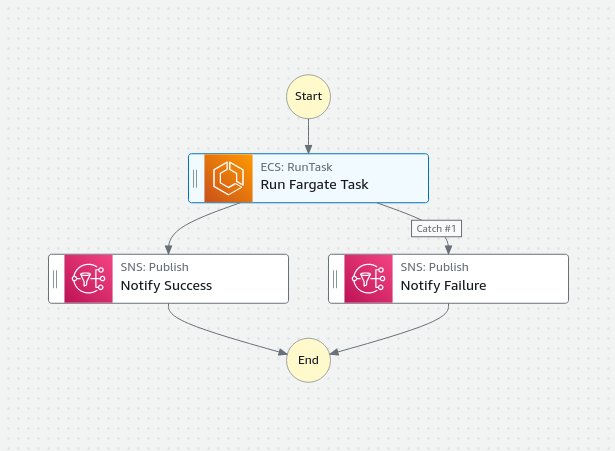

Running a scheduled job is easily done using Lambda and EventBridge. But what about scheduled job that'll take more than 15 minutes to complete? And what about monitoring and observability of the status of your scheduled task? ECS Fargate and Step Functions to the rescue!

<!--more-->

## Lambda is great! But...
Scheduling a job through Lambda is a simple affair. Set up the Lambda with the code you'd like to run, add an Event Bridge rule that triggers the Lambda job on a fixed schedule and you're done. These setups work just fine for all jobs that take less than a set amount of time - in the case of Lambda, you're only able to reliably get 15 minutes of runtime in total (although [some sources](https://www.pluralsight.com/resources/blog/cloud/how-long-does-aws-lambda-keep-your-idle-functions-around-before-a-cold-start) have seen way higher execution timeouts; don't depend on those though!). 

If and when (every platform or devops engineer will run into this at least once) a developer creates a scheduled task, they're going to need more than 15 minutes of runtime to finish. Jobs like these are either badly optimized, or it's trying to do too much in one go. Still, rewriting said task might take more time or effort than currently available, so we'll have to find a way of running it as is. This is where ECS comes in.

## Using ECS Fargate to run scheduled tasks
As ECS Fargate doesn´t have the same arbitrary limits on duration of execution and provides a similar "pay as you go" method of running your compute, it's one of the best drop-in-replacements for running tasks on Lambda. Event Bridge allows you to automatically start an ECS Task based on a specific Task Definition, meaning it can replace any Lambda currently being ran the same way.
Another method of running your ECS Tasks based on a scheduler is to use any of the supported Lambda runtime programming languages and use the AWS SDK (or similar library in any programming language) to start an ECS Task.

## Built-in task history, visibility and easy manual starts
When looking for a more "complete" solution for running scheduled tasks, including things like task history overviews, manually starting or restarting services and monitoring the current status of the ECS Task, we can use AWS Step Functions. A Step Function invocation can be managed by Event Bridge as well, meaning it's another drop-in replacement.

Using step functions to start an ECS Task is as simple as adding the `ECS: RunTask` step and setting up the correct inputs for the chosen task. Output of the task (e.g. whether the task started and finished properly) is automatically handled by Step Functions and can be used in any subsequent steps.

Whenever the step function is invoked, it will automatically show an execution history on the specific state machine's overview page, giving you access to the start datetime, end datetime, inputs, outputs and all logs that were part of said invocation. Each invocation can also be re-ran this way, meaning you'll be able to reprocess any failed scheduled tasks with new inputs if necessary.

## Scheduling jobs in AWS is easy
I haven't discussed task scheduling through currently running resources (e.g. your running EC2 instances or an EKS cluster) as I mainly focus on separating your workloads as much as possible and keeping costs down. Both of these have been handled by choosing a serverless solution where high CPU or memory usage won't impact your other, running services, and where you solely pay for the resources you've used up to the minute or even second.

Still, if you're already running a decent amount of servers (either as a Kubernetes cluster, or as bare EC2 instances) you can easily run your scheduled jobs there instead. If you're sure you won't ever impact your main workloads, that'll be my preferred way of working as well - if you've got these resources already running anyways, why not just go and use them as optimally as possible?