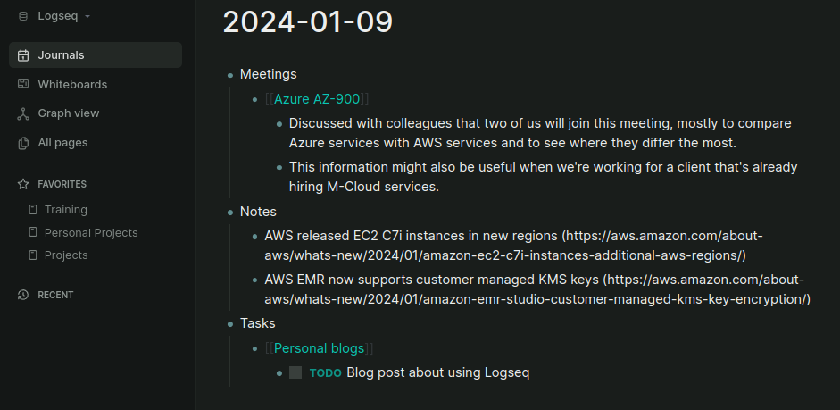
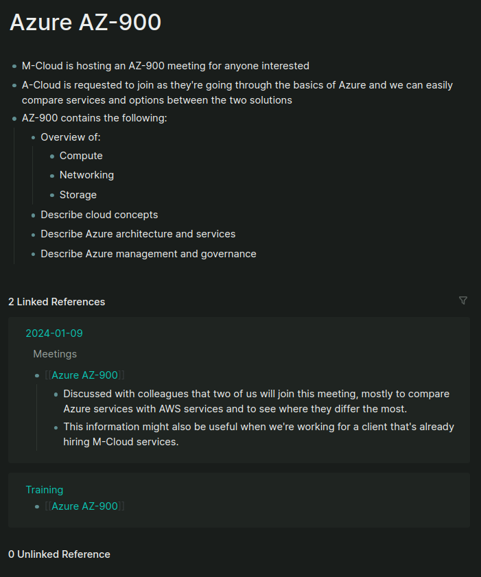

Ever since I've started learning things, I've tried putting them down in ink or pixels so I can easily recall the information later. Somehow, this never seemed to work and I couldn't find a way that worked with how my brain is wired up - either I'd document too much meaning it became an unreadable, unusable mess, or I'd document too little meaning I'd still have to memorize or re-analyze most of what I was trying to document. Starting at Devoteam, I thought it to be the perfect time to change this behaviour once and for all.

<!--more-->

## I don't like documenting stuff
Using paper or digital archives for documentation never really worked for me. I've always had the luxury of just remembering everything I needed for work and my studies, or I'd be able to find old code, chat messages and emails to spark my memory in case I couldn't. Still, I found myself forgetting more and more as the years passed. Apparently you can't just keep remembering everything you did all the time, and I've had a hard time coping with that.

Stubborn as I am, I kept pushing through until I came to the realization that I started forgetting important details of solutions I had once used, or particulars about client projects I was working on. The former was a huge inconvenience but the latter was actually becoming an issue in my day-to-day work, thus sparking the need to at least document some things. I started out with documenting project-specific stuff in our shared Google Drive along with technical documentation in the client's CSV project (e.g. the README.MD on Github).

I didn't yet feel the need to document anything else as this was enough to keep my work projects moving along. After a while, I once again found myself having some time left in the day to work on personal projects as well. Those projects always resided somewhere in the back of my head, and during the most inconvenient times (whilst on the edge of sleeping and begin awake, whilst on the toilet, whilst under the shower, whilst walking my kid to daycare... you know the drill) I'd think of new stuff to add or memorize stuff I'd love to do with those projects. Having found the usefulness of documentation for work, I figured I should be doing something similar for my personal projects as well.

## Too many tools, too many checkboxes
A few weeks before starting at Devoteam, I discussed multiple solutions for personal documentations with a few friends and ex-colleagues. The majority is in favor of tools like Obsidian, Notion or simple markdown files, created and updated with their editor of choice. Having tried all options, most of them felt either cumbersome or didn't contain everything I was looking for; I'll need at least a proper search functionality, preferrably be able to link topics/subjects together and have the ability of synchronizing everything across my devices.
I heard about Logseq before and thought it would be too complex for my use case until I found [an amazing YouTube video](https://youtu.be/pS5fyFWsZT4?si=80Z9GWeoEXUyor2g) that discussed a workflow that ticked all the boxes for me.

Logseq uses a different approach to documentation. The base setup starts out with a graph that you can fill up with data in whatever way you prefer. All data is stored in pages, and the main page (called "Journals") contains your journal for the given day. From said daily journal, all data you add can be linked to your other pages - either directly through a "Linked reference" or by Logseq looking for specific keywords as an "Unlinked reference". Both options provide you a connection between your dictated thoughts and the pages that actually sort and order the data for you based on when you added the entry.
Apart from that, you can also freely edit every other page, meaning you're able to add introductory data, extra information kept outside of your journals and more. In my mind, this solution provides a combination of a wiki (through (un)linked references between pages) and journal keeping (through the Journals page), making it easy to jot down new information but also keeping an extensive set of documents regarding specific topics if you so require.

## Separating work and life
Although Logseq was initially set up with a mindset that says "one graph to rule them all", the people behind the toolset have added a feature to switch between graphs. Each graph is just a separate directory on your local disk, so technically you're able to split up your graphs into anything you'd like; work-life, a graph per client, a graph per project, etc. Personally, I'm favoring just putting everything in one graph. I've tried separating work and life into two graphs, but switching between the two gave me too much downtime and running two instances of Logseq felt a bit tricky with accidentally entering work data in my life graph or vice versa (although nothing's permanent, so you're free to just cut+paste your data to the other instance).

Using one graph also lowers my barrier for entry; I don't have to think about which instance is for work or life and I don't have to think about which journal should contain what information. This also helps fix another issue - when, at any time, I'd like to add some data I gathered in my personal logs to my work logs, I can just metion a personal page on a work page or vice versa using Linked references.

## Current setup
As I've only been using Logseq for a couple of weeks now, I haven't had the time to do a real deep dive yet. Many projects are still pending, so I'm making due with what information I need to keep track of at the moment. Still, I've found that documenting everything and having a searchable graph made things way easier for me already. Keeping a log of discussed items regarding best practices, internal projects or any of my meetings has been invaluable when we were trying to discuss something we've spoke about previously after coming back from a two week holiday (starting a new job in December is great; you're "missing" at least 2 weeks of work due to Christmas and New Year's!).

For now I've gone with a simple setup: add meeting information, notes and tasks to your daily Journals, put each of the discussed projects in a separate page and link everything together using the Linked references. An overview of my setup is shown below:

I've mostly been using the "Favorites" as a reminder of everything I'm currently working on, along with a couple of items that I like to keep track of all the time (e.g. Training, Personal Projects). As of now I don't have any projects that require my attention and I've removed all finished projects from the Favorites list as well. This keeps the overview quite simple and barebones, which I really like - I don't like visual clutter as I can be distracted easily (so many times I've suddenly thought of something unrelated and started working on that instead).

The resulting page of me using Logseq in the way I like is shown below:

## Logseq works the way I think
Lastly, I'd like to discuss why I like Logseq above other (similar) tools that might even have feature parity. Logseq seems to work the way my mind does; creating a graph with all my pages of information and linking them together in a way that feels natural to me. It doesn't force you to link pages together, but gives you the option to through Linked References. If you forget linking a page, or if Logseq thinks the page should have a link based on some information, it'll still link them for you, but keeps that link "out of your way" in the "Unlinked reference" section. That way I don't have to see information I haven´t linked directly, but am still able to find something I might've missed.

The graphing system also does something I find to be very awesome as it gives me a visual representation of what's been stuck in my mind for all that time I didn't document stuff:

Apart from a minor bug where Logseq in dark mode doesn't show the vertices between points, the graph gives a clear overview of everything I'm working on and how they're linked together. I'll be using this mode a lot more in the future, especially when working with client projects where I might be splitting up work into separate pages and each of those pages should be linked together to create a complete picture of an entire project or workload.

## Conclusion
All in all, I think I've finally found a tool that'll work the way I like it to work. I don't feel the need to document everything, but everything I'd like to document can be stored in one single location after which I can link everything together and create coherent, recognizable pieces of data that help me keep track of my day-to-day. Creating an entire history of daily journals including the resulting pages of documentation has never been easier - thanks Logseq!

... Hopefully they do fix that visual bug with the graphs soon, though 😬